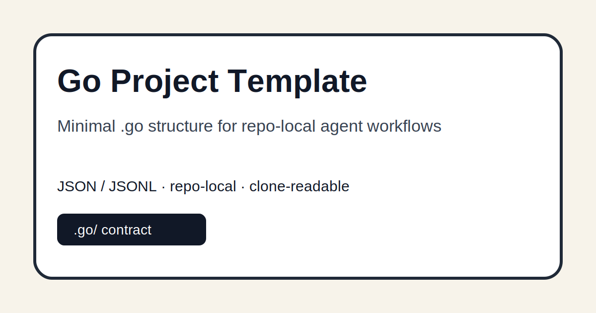

# Go Project Template



A minimal starter repository for projects that carry their own repo-local `.go/` agent workflow state.

Use this repo as the copyable template when starting a new project that should be understandable by agents from the repository alone. It pairs with [`go-workflow-stack`](https://github.com/viggomeesters/go-workflow-stack), which provides the CLI, schemas, validators, and reusable workflow rules.

## Practical architecture in one minute

This repo is the starter structure. The stack repo is the toolbelt. Your real project repo owns its own `.go/` state.

```text
go-workflow-stack  -> validates/operates -> project repo with .go/
go-project-template -> seeds/copies ------^
```

For the full architecture and practical application flow, see [`docs/practical-architecture.md`](docs/practical-architecture.md).

## What this gives you

```text
.go/
  project.json
  architecture-principles.json
  vision.json
  hierarchy.json
  tasks/open/task-schema-smoke.json
  evidence/events.jsonl
AGENTS.md
go
scripts/validate-go.sh
```

## Installation

Use GitHub's template/copy flow or clone the repository directly. Keep the `.go/` folder tracked when adapting it for a real project.

## Usage

Clone this template and let its check script prepare the sibling stack checkout if it is missing:

```bash
git clone https://github.com/viggomeesters/go-project-template.git
cd go-project-template
bash scripts/check.sh
./scripts/check-linux.sh
./go doctor . --platform wsl --agent hermes --json
```

After copying the template to a real project name, replace the template identity with the project's own durable contract:

```bash
export GO_STACK=../go-workflow-stack
export GO_EXECUTOR_AGENT=hermes
./go spike . \
  --brief "What this project must achieve"
```

`spike` recognizes the public template identity, removes only the synthetic template `.go` state, and creates project-specific vision, principles, hierarchy, and executable tasks.

If you already keep the stack somewhere else, point the template at it:

```bash
GO_STACK=/path/to/go-workflow-stack bash scripts/check.sh
```

Manual paired checkout flow:

```bash
git clone https://github.com/viggomeesters/go-workflow-stack.git
git clone https://github.com/viggomeesters/go-project-template.git
cd go-project-template
make check
```

Or validate directly from the stack repo:

```bash
cd ../go-workflow-stack
python3 cli/go.py validate ../go-project-template
python3 cli/go.py readback ../go-project-template
```

## Customize for a real project

Edit the `.go/` files:

- `.go/project.json`: project id, name, minimum compatible stack version, default verification.
- `.go/architecture-principles.json`: project constraints and enforcement rules.
- `.go/vision.json`: north star, wedge, target user, promise, non-goals.
- `.go/hierarchy.json`: epic-lite work packages, features, and task links.
- `.go/tasks/open/*.json`: first executable tasks.

Run `bash scripts/validate-go.sh` for the narrow clone-local contract check. Run `bash scripts/check.sh` for the full stack/template pairing check, including a bounded first `auto --execute` smoke in a temporary clone.

The executable `./go` launcher resolves `GO_STACK` or bootstraps the sibling stack checkout, so commands do not contain machine-specific paths. On a Hermes-first WSL machine:

```bash
export GO_EXECUTOR_AGENT=hermes
./go doctor . --platform wsl --agent hermes
./go go-loop . --execute --agent hermes
```

## Development

Use local validation before committing or publishing changes. The check compiles the Python CLI where applicable and validates the template repository contract.

```bash
make check
bash scripts/check.sh
```

`scripts/bootstrap-stack.sh` reads the immutable `stack_ref` only from `.go/project.json`. It rejects the legacy `GO_STACK_REF` environment override, clones the declared tag/commit for an automatically managed sibling checkout, and verifies an explicit `GO_STACK` provides the same declared runtime. This prevents a WSL machine from silently continuing on a different stack revision.

Hosted automation is not used. `scripts/check-linux.sh` is the authoritative local Linux/WSL verification path. Set `GO_REQUIRE_LIVE_HERMES=1` when the real Hermes binary must also pass `go doctor`.

## Privacy and security

The included `.go/` state is synthetic. Do not use private vault data, credentials, customer material, or local runtime artifacts in a public template.

## License

This project is released under the MIT License. See [`LICENSE`](LICENSE) for the full license text.
