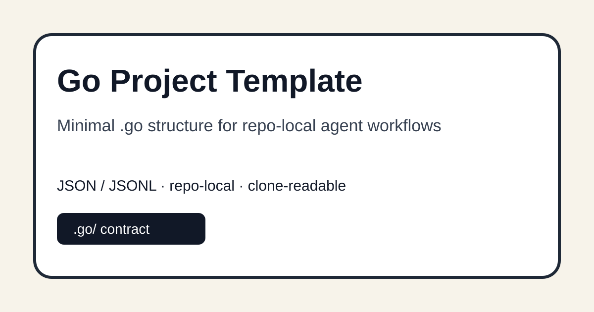

# Go Project Template



A minimal starter repository for projects that carry their own repo-local `.go/` agent workflow state.

Use this repo as the copyable template when starting a new project that should be understandable by agents from the repository alone. It pairs with [`go-workflow-stack`](https://github.com/viggomeesters/go-workflow-stack), which provides the CLI, schemas, validators, and reusable workflow rules.

This template pins `go-workflow-stack` `v0.3.26`, the immutable runtime
contract that requires stale repository pins to be updated before route,
task creation, claim, or product edits.

For `material` and `foundational` work, claim also fails closed until the task
or one of its applicable accepted architecture briefs references at least one
exact accepted governing decision. The synthetic template brief deliberately
contains no decision: real projects must record their own choices instead of
inheriting fake architecture authority from the starter repository.

For independent task releases, start with [explicit A/B/C onboarding](docs/abc-onboarding.md).
The starter has no default model or executable product lifecycle. Model/effort,
version source, permitted release destination, checks and workspace policy are
project choices. The released stack supports fresh workers in one task worktree;
persistent-session and subagent adapters remain deferred. The v0.3.26 live proof
used Terra High and Astra Medium for separate local releases.

For project work, `Go` is the single public repository-work command:

- `Go <outcome>` — infer discovery, planning, or execution and continue;
- `Go plan <work>` — prepare durable state and stop before implementation;
- `Go T123` — resume or execute a named repo-local task;
- `Go loop 2h <work>` — use a bounded autonomous loop.

Questions enter an advice route: they do not authorize implementation, but an
agent may store one compact chosen recommendation under
`.go/recommendations/pending.json`. Explicit `alleen advies` or `read-only`
writes nothing. A later bare `Go` or Codex **Sent as goal** promotes the pending
record into semantic tasks and executes them without another “maak taken” or
“aan de slag” relay.

Commands such as `auto`, `task create`, and `go-loop` remain internal stack
primitives for agents, scripts, and tests. Users should not have to sequence
them manually.

## Practical architecture in one minute

This repo is the starter structure. The stack repo is the toolbelt. Your real project repo owns its own `.go/` state.

```text
go-workflow-stack  -> validates/operates -> project repo with .go/
go-project-template -> seeds/copies ------^
```

For the full architecture and practical application flow, see [`docs/practical-architecture.md`](docs/practical-architecture.md).

## What this gives you

```text
.go/
  project.json
  architecture-principles.json
  vision.json
  hierarchy.json
  architecture/
    briefs/project-boundary.json
    events.jsonl
  tasks/open/task-schema-smoke.json
  evidence/events.jsonl
AGENTS.md
go
scripts/validate-go.sh
```

## Installation

Use GitHub's template/copy flow or clone the repository directly. Keep the `.go/` folder tracked when adapting it for a real project.

## Usage

Clone this template and let its check script prepare the immutable stack runtime in the user cache if it is missing:

```bash
git clone https://github.com/viggomeesters/go-project-template.git
cd go-project-template
bash scripts/check.sh
./scripts/check-linux.sh
./go doctor . --platform wsl --agent hermes --json
```

Before normal work in an existing repo-local Go project, use a trusted current
stack checkout as the update control plane. The update is deliberately separate
from the old pinned runtime so schema drift cannot masquerade as repository
corruption:

```bash
STACK_REPO=/path/to/go-workflow-stack
git -C "$STACK_REPO" fetch origin --tags
python3 "$STACK_REPO/cli/go.py" stack update . --latest --stack-repo "$STACK_REPO" --json
# Apply only when the dry run reports up_to_date=false:
python3 "$STACK_REPO/cli/go.py" stack update . --latest --stack-repo "$STACK_REPO" --apply --agent hermes --json
./go doctor . --platform wsl --agent hermes --json
```

Only after doctor reports `exact_ref=true`, `compatible=true`, and `ready=true`
may route, task creation, claim, or product editing begin. If the trusted source
checkout or annotated release cannot be verified, stop; do not continue through
mutable `main`, an old global runtime, or `GO_STACK_ALLOW_DEV=1`.

After copying the template to a real project name, replace the template identity with the project's own durable contract:

```bash
export GO_EXECUTOR_AGENT=hermes
./go spike . \
  --brief "What this project must achieve"
```

`spike` recognizes the public template identity, removes only the synthetic template `.go` state, and creates project-specific vision, principles, hierarchy, and executable tasks.

If you already keep the exact tagged stack somewhere else, point the template at it explicitly:

```bash
GO_STACK=/path/to/go-workflow-stack bash scripts/check.sh
```

Manual paired checkout flow:

```bash
git clone https://github.com/viggomeesters/go-workflow-stack.git
git clone https://github.com/viggomeesters/go-project-template.git
cd go-project-template
make check
```

Or validate directly from the stack repo:

```bash
cd ../go-workflow-stack
python3 cli/go.py validate ../go-project-template
python3 cli/go.py readback ../go-project-template
```

## Customize for a real project

Edit the `.go/` files:

- `.go/project.json`: project id, name, minimum compatible stack version, default verification.
- `.go/architecture-principles.json`: project constraints and enforcement rules.
- `.go/vision.json`: north star, wedge, target user, promise, non-goals.
- `.go/hierarchy.json`: epic-lite work packages, features, and task links.
- `.go/architecture/briefs/project-boundary.json`: accepted synthetic template-maintainer boundary with a measurable traceability attribute; customize it for the real project during adoption or remove `.go/architecture/` to keep the legacy lane disabled.
- `.go/architecture/events.jsonl`: append-only classification, review, conformance, deviation, and waiver events.
- `.go/tasks/open/*.json`: first executable tasks with explicit architecture impact where relevant.

Run `bash scripts/validate-go.sh` for the narrow clone-local contract check. Run `bash scripts/check.sh` for the full stack/template pairing check. The template test executes `task-schema-smoke` in an isolated fresh copy and asserts completed work state, approved review state, and structured runtime/billing-attributed finish evidence while preserving the source task as the reusable open fixture.

This template intentionally uses `bash scripts/validate-go.sh` as `.go/project.json`'s per-task `default_verification`. The broader `scripts/check-linux.sh` remains the outer repository/pairing gate. This lets auto-finish run a bounded project audit without recursively invoking another template-check. Projects created from this template retain capacity planning, separate work/review state, runtime/billing-attributed finish evidence, and automatically build deterministic standalone stakeholder HTML for substantial approved agent tasks. The pinned runtime defaults disclosure to restricted, supports explicit `required`/`none` overrides, versions successors immutably, and serializes approval/build/ship/rollback per epic.

The executable `./go` launcher resolves an explicit `GO_STACK` or bootstraps an isolated checkout under `${XDG_CACHE_HOME:-$HOME/.cache}/go-workflow-stack/<stack_ref>`, so it never repurposes a sibling development clone. On a Hermes-first WSL machine, tell the coding agent `Go`; internally it can use:

```bash
export GO_EXECUTOR_AGENT=hermes
./go doctor . --platform wsl --agent hermes
./go go-loop . --execute --agent hermes
```

The internal advice handoff is:

```bash
./go recommendation create . --brief /tmp/execution-brief.json \
  --authority advice --authority-source question
./go recommendation status . --json
./go go . --execute
```

The final command needs no chat transcript or brief path. It archives the
recommendation only after its tasks validate; successful verification and
critic then attach evidence to every requested outcome.

## Development

Use local validation before committing or publishing changes. The check compiles the Python CLI where applicable and validates the template repository contract.

```bash
make check
bash scripts/check.sh
```

`scripts/bootstrap-stack.sh` reads the immutable `stack_ref` only from `.go/project.json`. It rejects the legacy `GO_STACK_REF` environment override, clones the declared tag/commit into a tag-keyed user-cache checkout, and verifies an explicit `GO_STACK` provides the same declared runtime. This prevents a WSL machine from silently continuing on a different stack revision or detaching a sibling `go-workflow-stack` development checkout.

Hosted automation is not used. `scripts/check-linux.sh` is the authoritative local Linux/WSL verification path. Set `GO_REQUIRE_LIVE_HERMES=1` when the real Hermes binary must also pass `go doctor`.

## Privacy and security

The included `.go/` state is synthetic. Do not use private vault data, credentials, customer material, or local runtime artifacts in a public template.

## License

This project is released under the MIT License. See [`LICENSE`](LICENSE) for the full license text.
